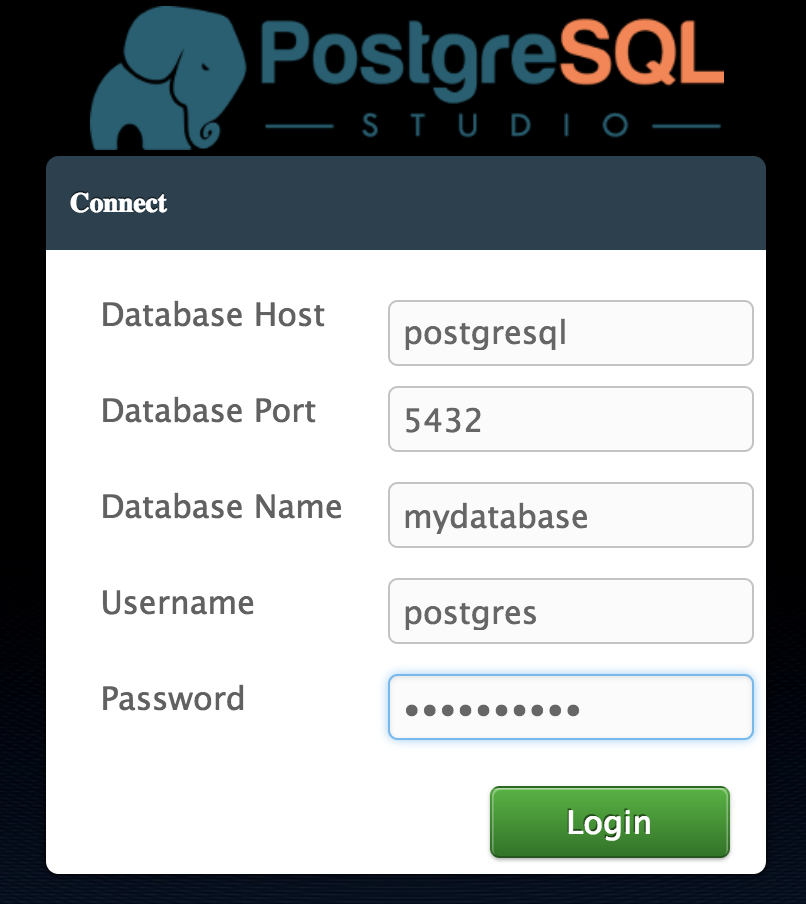

## Build and Debug a Java/Tomcat Application with PostgreSQL Locally

This guide walks you through the process of using Docker to build and test your Java/Tomcat application with PostgreSQL locally before uploading it to Stacksmith.

### TL;DR

Clone this repository, copy your WAR file into the `app/` directory and run the following commands:

```
docker-compose build
docker-compose up
```

You should now able to see the application running at `http://localhost:8080/NAME`, where NAME is the name of the WAR file. If you see the application running, you can go ahead and upload it to Stacksmith.

### Step 1: Create the Dockerfile and the docker-compose.yml file

At the time of writing, Stacksmith supports CentOS 7 as the underlying operating system.

This example copies the `app/` directory into the container in order to execute the scripts and deploy the WAR file. In this guide we use [PosgreSQL studio app](http://www.postgresqlstudio.org/), a Web-based PostgreSQL development application. You can download the WAR file from the downloads page.

```
FROM centos:7
LABEL maintainer "Bitnami <containers@bitnami.com>"

# Scripts
COPY ./app /app
WORKDIR /app
ENV UPLOADS_DIR /app

# Tomcat installation and war deployment
RUN chmod 755 *.sh && ./build-stacksmith.sh

# Build script
RUN ./build.sh

# Boot script
ENTRYPOINT ["/app/boot.sh"]

# Start Tomcat
CMD ["/app/run.sh"]
```

The docker-compose.yml file includes the database environment variables you can use to configure your application. In this example we are configuing the database name, user and password.

```
version: '2'
services:
  postgresql:
    image: 'bitnami/postgresql:latest'
    environment:
      - POSTGRESQL_DATABASE=mydatabase
      - POSTGRESQL_USERNAME=postgres
      - POSTGRESQL_PASSWORD=mypassword
    volumes:
      - 'postgresql_data:/bitnami'
  stacksmith:
    build: .
    ports:
      - '8080:8080'
    environment:
      - DATABASE_HOST=postgresql
      - DATABASE_NAME=mydatabase
      - DATABASE_USER=postgres
      - DATABASE_PASSWORD=mypassword
    depends_on:
      - postgresql
volumes:
  postgresql_data:
    driver: local
```

### Step 2: Define the `build.sh` script

This script is executed at build time. You can add any software you need from external repositories, in this case we install the PostgreSQL JDBC connector.

```
#!/bin/bash

# Extra packages
# JDBC library for tomcat for enabling connections to a PostgreSQL database
yum install -y postgresql-jdbc && yum clean all && rm -fR /var/cache/yum

echo "=== FINISH BUILD SCRIPT ==="
```

### Step 3: Define the `boot.sh` script

This script is executed at boot time. In this case, all it does is configure the `JAVA_OPTS` variable and show the database environment variables, but you can add other steps to it as well if needed.

The PostgreSQL Studio does not require any change to use the PostgreSQL database, but it is usual you need to modify an application configuration file for configuring the database connection. You can use the same environment variables for that purpose. 

```
#!/bin/bash
set -euo pipefail

# WARNING: the password will be shown in the logs. Remove it if you want to hide that password.
# You can use those env vars 
echo "=== DATABASE ENV VARS ==="
echo "DATABASE_HOST: ${DATABASE_HOST}"
echo "DATABASE_NAME: ${DATABASE_NAME}"
echo "DATABASE_USER: ${DATABASE_USER}"
echo "DATABASE_PASSWORD: ${DATABASE_PASSWORD}"

exec "$@"

```

### Step 4: Build the Docker image and test the application

After adding your WAR file to the `app/` directory and customizing the scripts, build the Docker image and run it locally. The following commands should be executed in the same directory as the `docker-compose.yml`.

```
docker-compose build
docker-compose up
```

Access your web application at `http://localhost:8080/NAME`, where NAME is the name of the WAR file.

The PostgreSQL Studio web application would be running at `http://localhost:8080/pgstudio` and it requires to add the PostgreSQL credentials at the login page:

```
Database Host: postgresql
Database Port: 5432
Database Name: mydatabase
Username: postgres
Password: mypassword
```




If your application works as expected, you can now upload the WAR file, `build.sh` and `boot.sh` scripts to Stacksmith and build the AWS AMI or the Helm chart to deploy your application on AWS or in a Kubernetes cluster.

Once the builds are complete, you can find more information about how to deploy your solution at the [Stacksmith Support page](https://beta.stacksmith.bitnami.com/support/).

### Deploying the PostgreSQL Studio application in Kubernetes

In this specific example, in order to log in the application we need to know the randomly generated database, user and password by Stacksmith. If you already deployed this example in Kubernetes you can get those values from the container log.

Check your helm chart deployments in your cluster and check the status of this.

```
helm list
helm status RELEASE_NAME
```

The output would be similar to the following one:

```
LAST DEPLOYED: Thu Feb  8 12:30:20 2018
NAMESPACE: default
STATUS: DEPLOYED

RESOURCES:
==> v1/Service
NAME                             TYPE       CLUSTER-IP     EXTERNAL-IP  PORT(S)   AGE
zooming-sheep-postgresql         ClusterIP  10.30.255.194  <none>       5432/TCP  16m
zooming-sheep-postgresql-studio  ClusterIP  10.30.255.121  <none>       80/TCP    16m

==> v1beta1/Deployment
NAME                             DESIRED  CURRENT  UP-TO-DATE  AVAILABLE  AGE
zooming-sheep-postgresql         1        1        1           1          16m
zooming-sheep-postgresql-studio  1        1        1           1          16m
```

You can check the log from the container and find the environment variables you need in order to log in the application and manage the PostgreSQL database.

```
kubectl logs -l app=zooming-sheep-postgresql-studio

=== DATABASE ENV VARS ===
DATABASE_HOST: zooming-ibis-postgresql
DATABASE_NAME: appdb
DATABASE_USER: myapp
DATABASE_PASSWORD: ******
```

